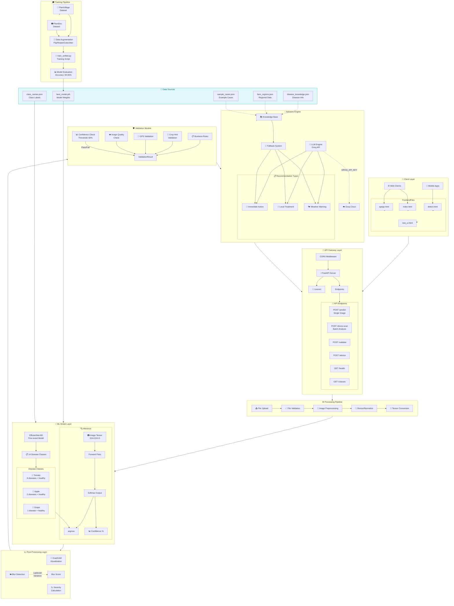

# AgriVision System Architecture



---

## Component Descriptions

### 🎨 Client Layer
- **agrigo.html**: Landing page with product information
- **index.html**: Main dashboard with features overview
- **detect.html**: Disease detection interface (primary)
- **test_ui.html**: API testing UI for developers

### 🚀 API Gateway Layer
- **FastAPI**: Python web framework for REST APIs
- **Uvicorn**: ASGI server for running FastAPI
- **CORS**: Cross-origin resource sharing enabled

### ⚙️ Processing Pipeline
1. **File Upload**: Accepts image files (PNG, JPEG, WebP)
2. **File Validation**: Checks file type, size limits
3. **Preprocessing**: Resizes to 224×224, normalizes
4. **Tensor Conversion**: Converts to PyTorch tensor

### 🤖 ML Model Layer
- **EfficientNet-B0**: Lightweight CNN, pre-trained on ImageNet
- **14 Classes**: 3 Apple + 2 Grape + 9 Tomato diseases (including healthy)
- **Training**: Fine-tuned on PlantVillage + PlantDoc dataset

### 📈 Post-Processing Layer
- **Grad-CAM**: Visual heatmap showing disease-affected regions
- **Severity Score**: 0-100 damage assessment
- **Blur Detection**: Checks image quality via Laplacian variance

### 🛡️ Validation Module
- **Confidence Threshold**: Rejects predictions below 60%
- **Image Quality**: Flags blurry images
- **GPS Validation**: Validates coordinates for location-aware advice
- **Crop Hint**: Optional crop selection validation

### 💡 Advisory Engine
- **Groq LLM**: Uses llama3-8b-8192 model for recommendations
- **Knowledge Base**: JSON files with disease information
- **Fallback**: Default recommendations if API unavailable

### 💾 Data Sources
- `disease_knowledge.json`: Disease symptoms and treatments
- `farm_regions.json`: Regional farming data
- `sample_cases.json`: Example prediction cases
- `best_model.pth`: Trained model weights
- `class_names.json`: 14 class labels

### 🎓 Training Pipeline
- **Dataset**: PlantVillage + PlantDoc (~17,000 balanced images after merging)
- **Augmentation**: Horizontal/Vertical flip, rotation, color jitter
- **Training Script**: train_unified.py with frozen + unfrozen epochs
- **Evaluation**: 94.65% accuracy on test set

---

## API Endpoints

| Endpoint | Method | Description |
|----------|--------|-------------|
| `/predict` | POST | Single image disease detection |
| `/drone-scan` | POST | Batch analysis for multiple images |
| `/validate` | POST | Validate prediction confidence |
| `/advice` | POST | Get treatment recommendations |
| `/health` | GET | Check server status and model |
| `/classes` | GET | List supported disease classes |

---

## Dependencies

### Python Packages
- **FastAPI**: Web framework
- **Uvicorn**: ASGI server
- **PyTorch**: Deep learning framework
- **OpenCV**: Image processing
- **NumPy**: Numerical computing
- **Pillow**: Image handling
- **scikit-learn**: Metrics (F1, precision, recall)

### External Services
- **Groq Cloud**: LLM API for recommendations
- **HuggingFace**: Model weights download

---

## Data Flow Summary

```
User Upload → Validation → Preprocess → ML Inference → Post-Processing
     ↓              ↓            ↓            ↓              ↓
   UploadFile   File Type   Resize 224   EfficientNet   Grad-CAM
                Size Check  Normalize    14 Classes      Severity
                                              ↓
                                    Validation Module
                                              ↓
                                    Advisory Engine
                                              ↓
                                    Response to Client
```