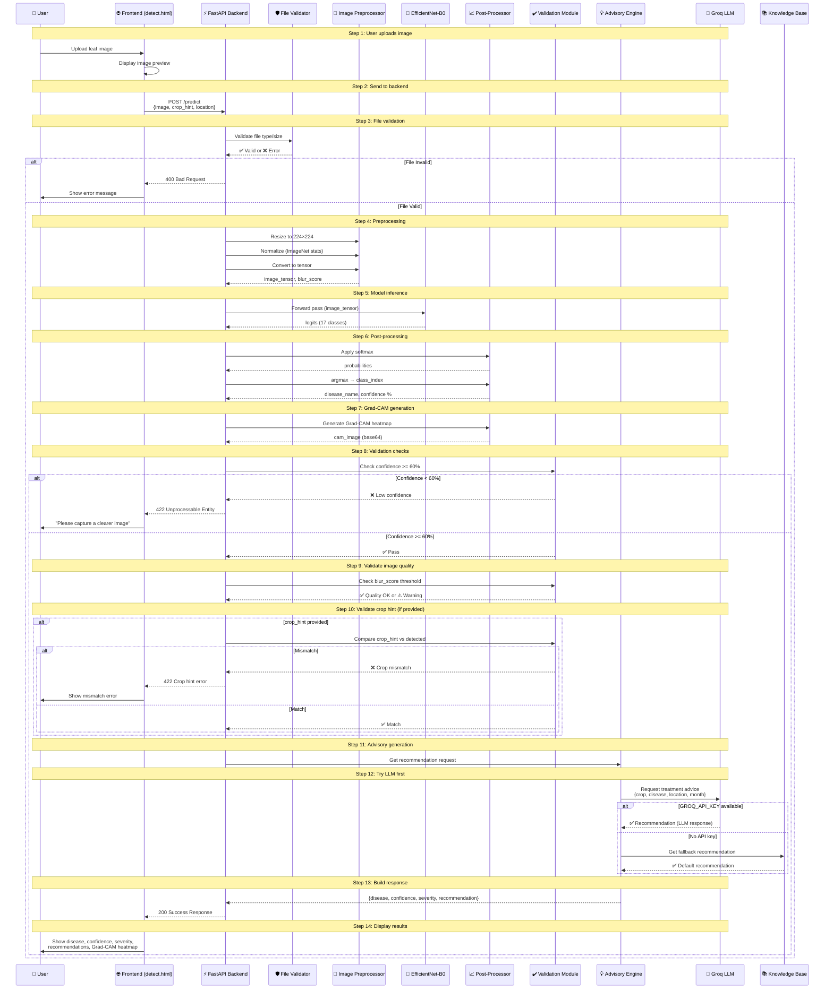
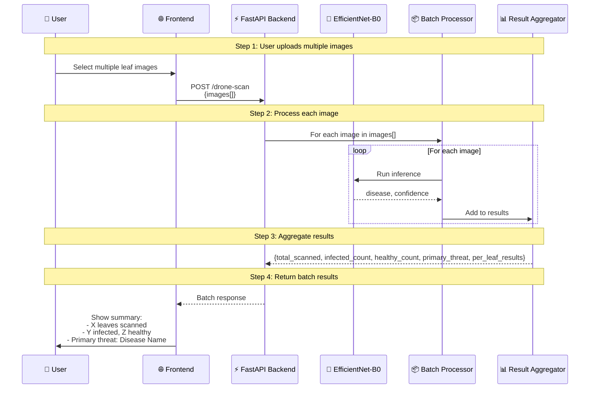
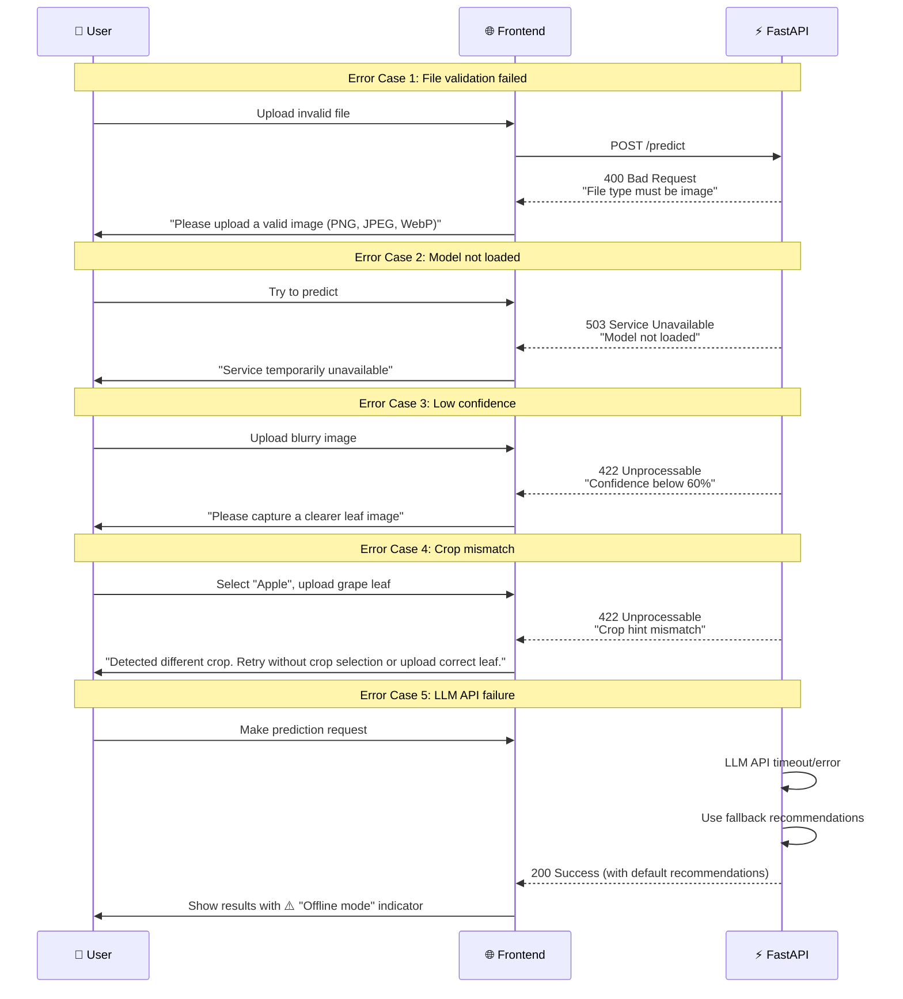
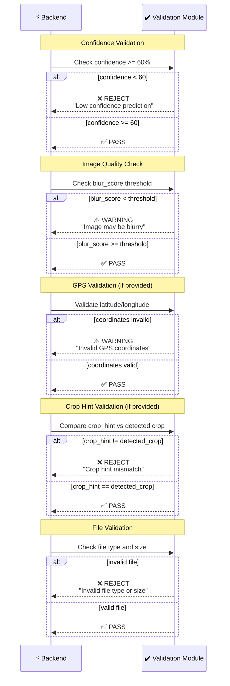
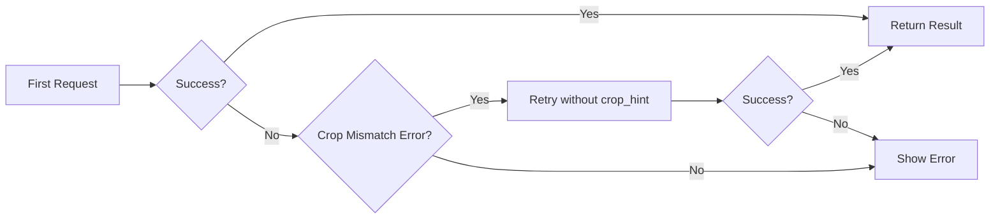

# AgriVision Sequence Diagrams

## Single Image Prediction Flow

---

## Drone Scan (Batch Processing) Flow

---

## Error Handling Flow

---

## Validation Check Sequence

---

## Key Timing Notes

| Step | Approximate Time |
|------|------------------|
| File upload | Depends on network |
| Preprocessing | ~50ms |
| Model inference | ~100-200ms (GPU), ~500ms (CPU) |
| Grad-CAM generation | ~100ms |
| LLM API call | ~1-3s (if available) |
| **Total** | **~1-4 seconds** |

---

## Retry Logic

The frontend has built-in retry logic:
1. If crop mismatch error → retry without crop_hint
2. If other error → show error to user